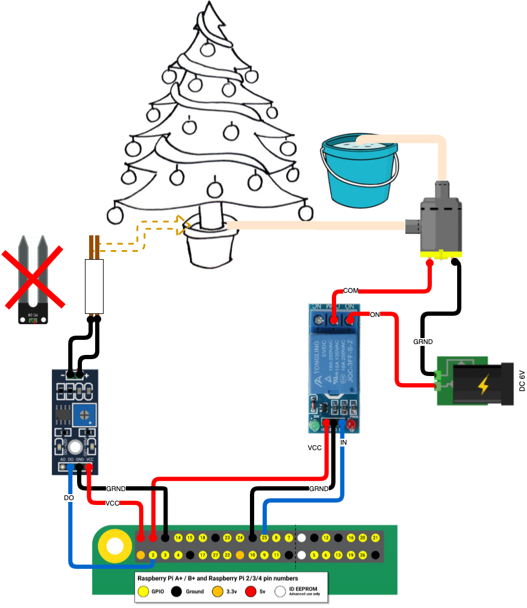

# PI Tree Watering System
The automatic watering system to water Christmas trees with monitoring.

## Devices
- [Raspberry PI any model](https://amzn.to/3nE8tsk)
- [Relay JQC-3FF-S-Z](https://amzn.to/38jBsez)
- [Moisture Sensor](https://amzn.to/3h5OksS) Do not recommend this one, as it only holds for one week after it broke because of rust. I already ordered another sensor type for the test. However, I used the sensor's processor.
- [Water Pump](https://amzn.to/2WwcDGI)

## Storage [JsonBox](https://jsonbox.io/)
The system uses JsonBox to store the logs.
- navigate to the link and get the box id from the link on hte home page
## System Setup

### Relay
Connect the relay to the Raspberry PI:
- VCC --> Pin 2 (5V)
- GND --> Pin 20 (Ground)
- IN  --> Pin 22 (GPIO 25)

### Moisture Sensor
Connect the moisture sensor to Raspberry PI:
- VCC --> Pin 4 (5V)
- GND --> Pin 6 (Ground)
- DO  --> Pin 3 (GPIO 2)
The original sensor did not hold for me for more than a week. Rust destroyed the sensor. I replaced this sensor with two regular copper wires used for the house's electricity, and it worked much better. 
### Water Pump
Connect the water pump to the relay:
- plus --> COM
- minus --> DC Power Supply minus
- Relay ON --> DC Power Supply plus

### Application Installation on Raspberry PI
- `$ git clone https://github.com/ypanshin/pi-tree-watering.git` - clone the repository
- `$ cd pi-tree-watering` - navigate to the project folder
- `$ nano package.json` - update `config` section of `package.json`
```
"config": {
    "sensorPin": 3, // the pin that moisture sensor connected to.
    "relayGpio": 25, // the GPIO that the relay connected to
    "onInterval": 1000, // the interval in ms to check the moisture sensor when the relay is on (the pump is working).
    "offInterval": 60000, // the interval in ms to check the moisture sensor when the relay is off (the pump is not working).
    "pumpFlow": 1.5, // the pump flow in litters per minute
    "maxLogItems": 1000, // the maximum items in the log
    "binId": "box_6f937824ca2f42a8a471" // the box id
  },
```
- `$ npm i && npm run build && npm start` - install, build and run the application

### Reset the logs and statistics
Get all nodejs processes
```
$ ps aux | grep dist/index
```
Reset the statistics by process signals
```
$ sudo kill -s SIGUSR1 <pid of node dist/index>
```

### Run the application On Raspberry Pi At Startup
Running the application on boot:
```
sudo nano /etc/rc.local
```
On the line before `exit 0` write the following script, replacing `{path to application}` with the directory of your application
```
su pi -c 'sudo npm start --prefix /home/pi/{path to application} < /dev/null &' 
```
Write out the lines to save them (CTRL-X) and then `$ sudo reboot` to restart your RPi

## [Dashboard](https://pi-tree-watering.tech.panshin.me)
The dashboard is an Ionic / React application that displays statistics and logs from the JsonBox log file.
Please use the JsonBox Id configured in your Raspberry Pi Application, or for the demo, you can use mine: `box_6f937824ca2f42a8a471`